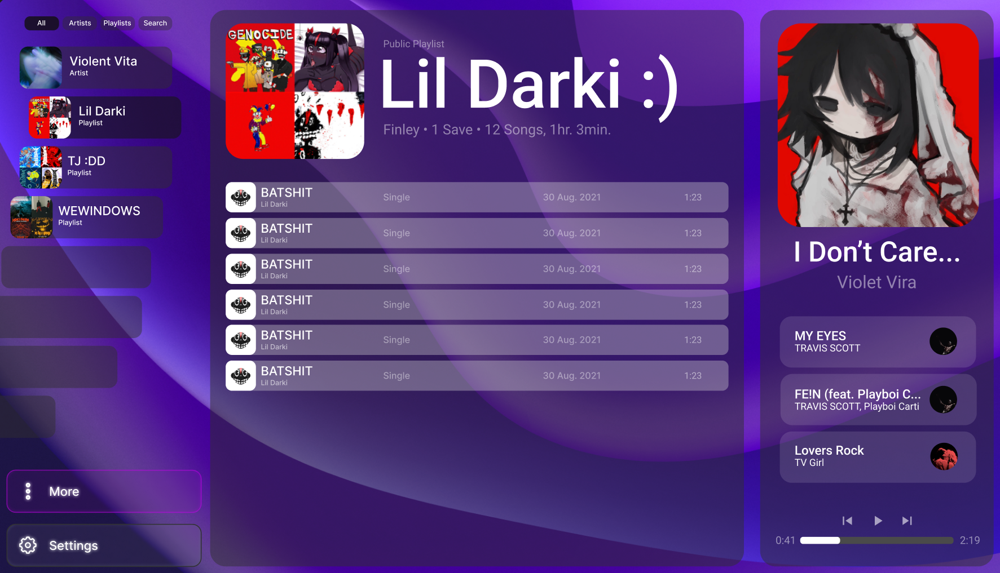

# Rustify

Rustify is an alternative Spotify client offering a build using NextUI for the frontend, Rust for the backend and wrapped with Tauri.

## UI Design
_This is only a theoretical design which is not final and does not exist in code yet!_

## Roadmap

- [x] Design UI
- [ ] Turn UI Design into Code
    - [x] Layout
    - [x] Screens
    - [ ] Home Page
    - [ ] Login Page
    - [ ] Immersive View - Cinema
    - [ ] Immersive View - Text
- [ ] Hook into Spotify API
- [ ] Add Multi Language Support
    - [ ] German
    - [ ] Italian
    - [ ] Polish
    - [ ] More
- [ ] Add local file support
- [ ] Hook into Soundcloud API
- [ ] Local/Service Playlists (Local Playlists may contain non Spotify songs)
